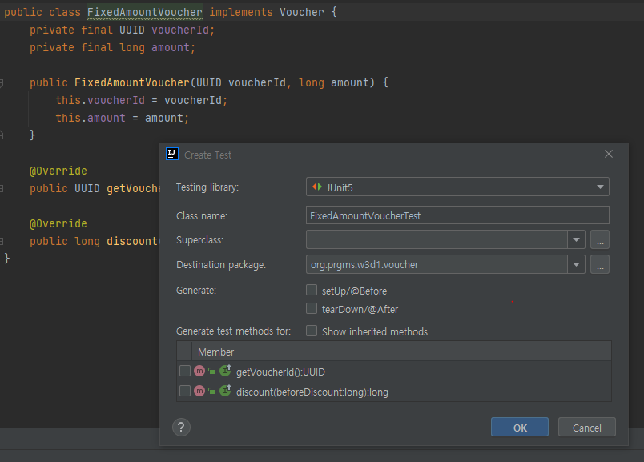

## W4D1(2)

### Mock Object(모의 객체)

- 목 오브젝트는 행위 검증을 사용하고, stub(가짜 데이터)을 포함한 다른 대역들은 상태검증을 사용합니다.
  - 행위 검증 : 메서드의 리턴 값으로 판단할 수 없는 경우, 특정 동작을 수행하는지 확인하는 검증법
  - 상태 검증 : 메서드가 수행된 후, 객체의 상태를 확인하여 올바르게 동작했는지를 확인하는 검증
- 인텔리제이를 이용해서 쉽게 만들 수 있음 - setUp : 테스트를 하기 전에 무언가 설정해야하는 경우 - tearDown : 테스트를 한 후에 무언가 해야하는 경우, 클리너 등등
  

- Mock Object 생성을 도와주는 Test Framework
    - Mockito
    - JMock
    - EasyMock

### Mockito 실습
- stub(가짜 데이터)을 만들어서 전달한다.
```java
class OrderServiceTest {

    @Test
    void createOrder(){
//        When
        var voucherService = new VoucherService(new MemoryVoucherRepository());
        var sut = new OrderService(voucherService, new MemoryOrderRepository());
    }
}
```
- 이너클래스를 만들어서 쓸수도 있다.
```java
class OrderServiceTest {

    class OrderRepositoryStub implements OrderRepository {

        @Override
        public Order insert(Order order) {
            return null;
        }
    }

```
- Given-when-then
```java
    @Test
    void createOrder(){
//        Given : 데이터를 만들어 특정 상황을 만든다
        var voucherRepository = new MemoryVoucherRepository();
        Voucher fixedAmountVoucher = new FixedAmountVoucher(UUID.randomUUID(), 100);
        voucherRepository.insert(fixedAmountVoucher);
        var sut = new OrderService(new VoucherService(voucherRepository), new MemoryOrderRepository());
//        When  : 특정데이터가 만들어 질 때의 행동 
        var order = sut.createOrder(UUID.randomUUID(), List.of(new OrderItem(UUID.randomUUID(), 200, 1)), fixedAmountVoucher.getVoucherId());

//        Then : 행동 후의 결과
        assertThat(order.totalAmount(), is(100L));
        assertThat(order.getVoucher().isEmpty(), is(false));
        assertThat(order.getVoucher().get().getVoucherId(), is(fixedAmountVoucher.getVoucherId()));
        assertThat(order.getOrderStatus(), is(OrderStatus.ACCEPTED));
    }
```

- mock의 경우 행위에 집중을 해야하기 때문에 어떤 메서드를 사용해야할지 명시해야한다.
```java
    @Test
    @DisplayName("오더가 생성되야한다. (mock)")
    void createOrderByMock(){
//        Given
        var voucherServiceMock = mock(VoucherService.class);
        var orderRepositoryMock = mock(OrderRepository.class);
        var fixedAmountVoucher = new FixedAmountVoucher(UUID.randomUUID(), 100);
        when(voucherServiceMock.getVoucher(fixedAmountVoucher.getVoucherId())).thenReturn(fixedAmountVoucher);
        var sut = new OrderService(voucherServiceMock, orderRepositoryMock);

//        When
        var order = sut.createOrder(UUID.randomUUID(),
                List.of(new OrderItem(UUID.randomUUID(), 200, 1)),
                fixedAmountVoucher.getVoucherId());
//        Then
        // 상태검증
        assertThat(order.totalAmount(), is(100L));
        assertThat(order.getVoucher().isEmpty(), is(false));
        // 행위검증
        verify(voucherServiceMock).getVoucher(fixedAmountVoucher.getVoucherId());
        verify(orderRepositoryMock).insert(order);
        verify(voucherServiceMock).useVoucher(fixedAmountVoucher);
    }
}
```
단계는 이렇다.
1. 테스트를 위한 mock 객체를 만든다(검증해야할 기능에서 필요한 부분만 사용하기위해)
2. when을 통해서 해당 객체의 특정 메서드 사용을 가정하고 그에 맞는 동작(ex. return, throw)을 수행한다.
3. verify를 통해서 목 객체의 특정 메서드가 사용되었는지 검사한다.

-  inOrder() 메서드를 통해서 행위의 순서까지 검사할수있다.
- inOrder에 순서를 확인할 mock 객체를 넣어주고 inOrder.verify() 메서드를 통해서 순서도 확인가능하다
```java
        var inOrder = inOrder(voucherServiceMock);
        inOrder.verify(voucherServiceMock).getVoucher(fixedAmountVoucher.getVoucherId());
        inOrder.verify(voucherServiceMock).useVoucher(fixedAmountVoucher);
        verify(orderRepositoryMock).insert(order);
```
- 여러개의 목 객체를 넣어서 확인도 가능하다.
```java
        var inOrder = inOrder(voucherServiceMock, orderRepositoryMock);
        inOrder.verify(voucherServiceMock).getVoucher(fixedAmountVoucher.getVoucherId());
        inOrder.verify(orderRepositoryMock).insert(order);
        inOrder.verify(voucherServiceMock).useVoucher(fixedAmountVoucher);
```
___
## Spring의 JUnit 5 지원
- 스프링은 우리가 만들수 없는 환경관련 목오브젝트를 지원한다
    - Environment
    - JNDI
    - Servlet API
    - Spring Web Reactive
- 스프링은 통합테스트 쪽에서 많은 지원을 해준다(빈들간의 커뮤니케이션, 인테그레이션 등등)
- testContext의 캐시 기능으로 새롭게 컨테이너를 만드는게 아니라 기존에 만들었던 컨테이너를 재사용하는 이점이 있다.

### 실습 드가자~
- @ContextConfiguration 어노테이션을 통해서 테스트용 어플리케이션 컨텍스트를 만들수 있다(AppContext를 Autowire를 통해 가져올수있음).
- 이때 JUnit을 쓰기위해서 ExtendsWith 어노테이션으로 SpringExtension을 가져온다
```java
@ExtendWith(SpringExtension.class)
@ContextConfiguration
public class KdtSpringContextTests {

    // 똑같은 이름의 클래스 조심해라...
    @Autowired
    ApplicationContext context;
```
- 이렇게 가져와도 실제로 빈에대한 메타데이터가 없기 때문에 빈을 생성하려할경우 에러가 발생한다.
```java
@ExtendWith(SpringExtension.class)
@ContextConfiguration
public class KdtSpringContextTests {

    @Autowired
    ApplicationContext context;

    @Test
    @DisplayName("어플리케이션 컨텍스트가 생성되야 한다.")
    public void testApplicationContext(){
        assertThat(context, notNullValue());
    }
    // 에러
    @Test
    @DisplayName("빈의 생성 테스트")
    public void testVoucherRepository(){
        var bean = context.getBean(VoucherRepository.class);
        assertThat(bean, notNullValue());
    }
}
```
- 이를 위해서 특정 config를 들고와 읽어주면된다.
```java
@ContextConfiguration(classes = {AppConfiguration.class})

```
- 특정 config를 만들어사용 할 수도 있다
- 이럴 경우 ContextConfiguration에 등록된게 없다면 해당 config를 찾는다
```java
@ExtendWith(SpringExtension.class)
@ContextConfiguration
public class KdtSpringContextTests {

    @Configuration
    static class Config{
        @Bean
        VoucherRepository voucherRepository(){
            return new VoucherRepository() {
                @Override
                public Optional<Voucher> findById(UUID voucherId) {
                    return Optional.empty();
                }

                @Override
                public Voucher insert(Voucher voucher) {
                    return null;
                }
            };
        }
    }

    @Autowired
    ApplicationContext context;

    @Test
    @DisplayName("빈의 생성 테스트")
    public void testVoucherRepository(){
        var bean = context.getBean(VoucherRepository.class);
        assertThat(bean, notNullValue());
    }
```
- 위에 2개의 에노테이션을 합칠 수 있다.
```java
@SpringJUnitConfig(classes = {AppConfiguration.class})
public class KdtSpringContextTests {

```
- 내부에 static class Config에서 테스트할 메타데이터를 들고와서 테스트 하면된다.
```java
@SpringJUnitConfig()
public class KdtSpringContextTests {

    @Configuration
    @ComponentScan(basePackages = {"org.prgms.w3d1.voucher", "org.prgms.w3d1.order", "org.prgms.w3d1.config"})
    static class Config{

    }

    @Autowired
    ApplicationContext context;

    @Test
    @DisplayName("어플리케이션 컨텍스트가 생성되야 한다.")
    public void testApplicationContext(){
        assertThat(context, notNullValue());
    }

    @Test
    @DisplayName("빈의 생성 테스트")
    public void testVoucherRepository(){
        var bean = context.getBean(VoucherRepository.class);
        assertThat(bean, notNullValue());
    }
}
```
- @ActiveProfiles 어노테이션으로 profile 지정도 가능하다
```java
@SpringJUnitConfig()
@ActiveProfiles("test")
public class KdtSpringContextTests {

    @Configuration
    @ComponentScan(basePackages = {"org.prgms.w3d1.voucher", "org.prgms.w3d1.order", "org.prgms.w3d1.config"})
    static class Config{

    }

    @Autowired
    ApplicationContext context;

    @Autowired
    OrderService orderService;

    @Autowired
    VoucherRepository voucherRepository;

    @Test
    @DisplayName("어플리케이션 컨텍스트가 생성되야 한다.")
    public void testApplicationContext(){
        assertThat(context, notNullValue());
    }

    @Test
    @DisplayName("빈의 생성 테스트")
    public void testVoucherRepository(){
        var bean = context.getBean(VoucherRepository.class);
        assertThat(bean, notNullValue());
    }

    @Test
    @DisplayName("OrderService를 이용해서 주문을 생성할 수 있다.")
    public void testOrderService(){
        //        Given
        var fixedAmountVoucher = new FixedAmountVoucher(UUID.randomUUID(), 100);
        voucherRepository.insert(fixedAmountVoucher);
//        When
        var order = orderService.createOrder(UUID.randomUUID(),
                List.of(new OrderItem(UUID.randomUUID(), 200, 1)),
                fixedAmountVoucher.getVoucherId());

//        Then
        assertThat(order.totalAmount(), is(100L));
        assertThat(order.getVoucher().isEmpty(), is(false));
        assertThat(order.getVoucher().get().getVoucherId(), is(fixedAmountVoucher.getVoucherId()));
        assertThat(order.getOrderStatus(), is(OrderStatus.ACCEPTED));

    }
}
```